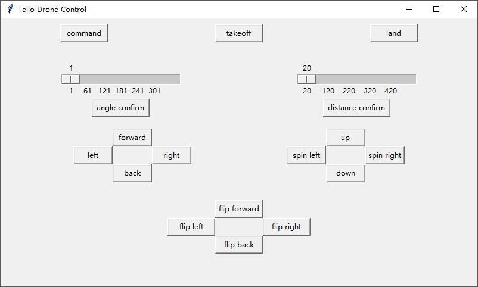

# A simple GUI of Tello control


# Simple-tello-control-GUI
## GUI test
run **tello-control-GUI.py** with python3. First to press the command buttom to enter the the SDK mode, then you can press takeoff button and do other operations.


## Predefined commands mode
Write the command set to be run in command.txt, for example:：
```
command
takeoff
delay 1
up 20
delay 1
foward 20 
delay 1
right 20 
delay 1
back 20 
delay 1
left 20 
delay 1
land
```

The script will automatically send a command to Tello. After receiving the reply from the previous command, the next command will be sent immediately. To add a delay, you can use the Delay command and the script will automatically delay. The unit of delay is seconds, which can be given to decimals.

Run the **tello-command-test.py** script

After the execution is finished, the commands and execution information will be stored in the log.
